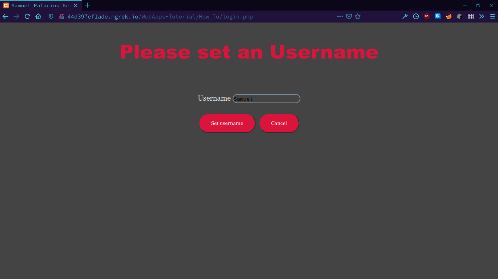
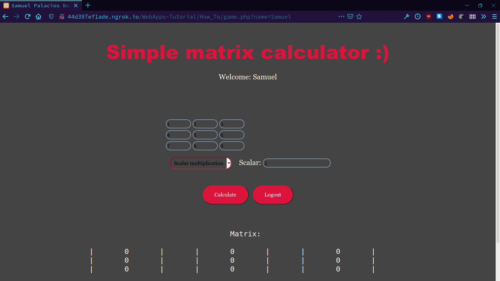
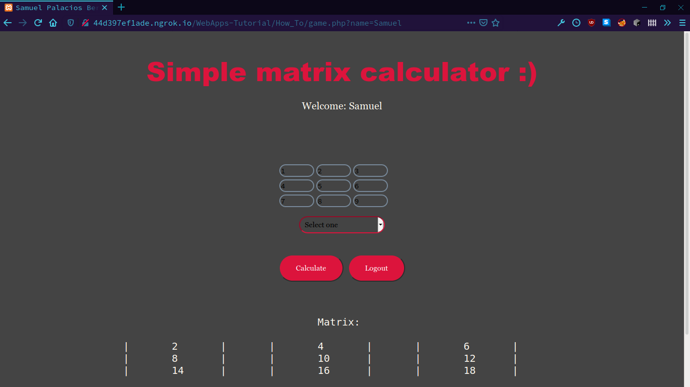
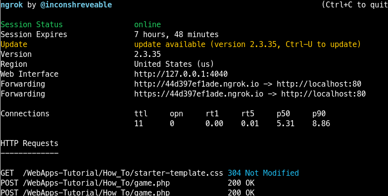

# Developing a web application using HTML, CSS, PHP and NGROK

Here you will find a short tutorial explaining the necessary concepts to start developing your own web application using tools like XAMPP and NGROK on PHP, HTML and CSS, you can also find code examples and workflow in this same directory.

The proper order to view the tutorial will be as follows:

1. [Web Basics](WEB_BASICS.md)
2. [HTML, CSS and PHP](HTML_CSS_PHP.md)
3. [Deploying with ngrok](DEPLOY_APP.md)

## Screnshoots
Here are some example images of what a web application might look like.

